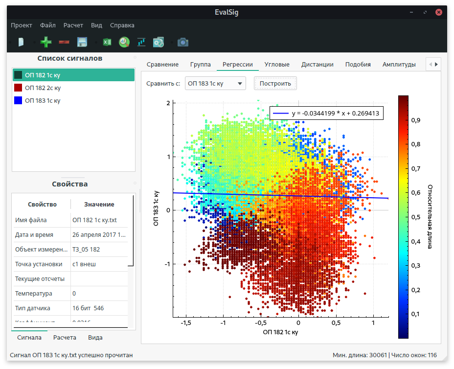

## Aim
The program is aimed at finding technological defects in power lines. 

## How does it work?
Firstly several sensor signals are preprocessed. According to features of measurements the following procedures can be applied:
- Approximation by smooth splines; 
- Integration;
- Interpolation;
- Time-domain slicing;
- FFT with overlapping windows. The mean moving filter can be applied to average it. Also, the different window functions are available to choose (Hamming, Hann, Blackman); 
- Band-pass and linear filters.

Then each time signal can be divided into several levels by means of overlapping windows in accordance with its values. After that, the parts of the time signal which are belonged to the same level are united with each other based on their values and first derivatives. The aforementioned algorithm is repeated for each loaded signal. Finally, the following statistics between the levels which are belonged to the same signal are calculated:
- Angle;
- Distance;
- Similarity;
- Noise;
- Regression.
     
In addition to that analysis it is possible to find a linkage between the levels from the different time signals. 

## Features

- The program provides possibility to automate its work. For instance, the sequence of processing can be created once and then duplicated by using binary templates. Each stage of the processing can be recorded automatically if it is needed. 
- There is a possibility to unload the results in different formats for a further analysis. 

## GUI

* Main window

* Linear regression

* Group comparison

* Creating of levels

